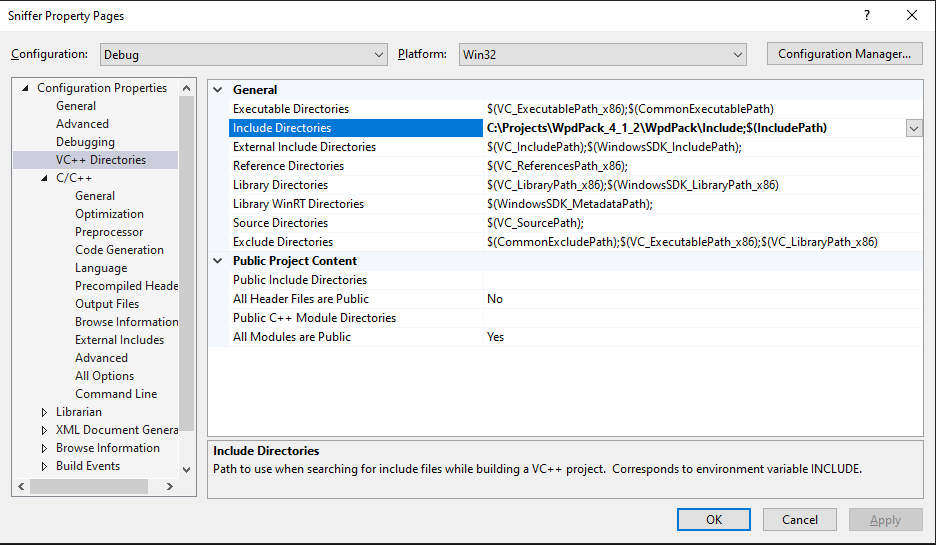
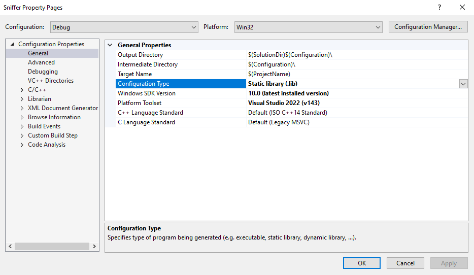
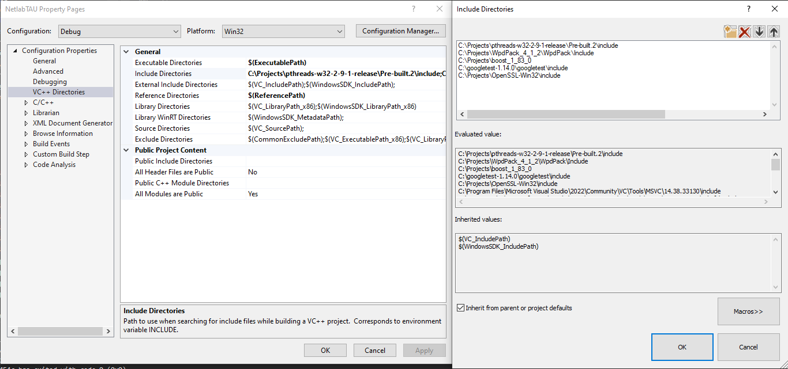
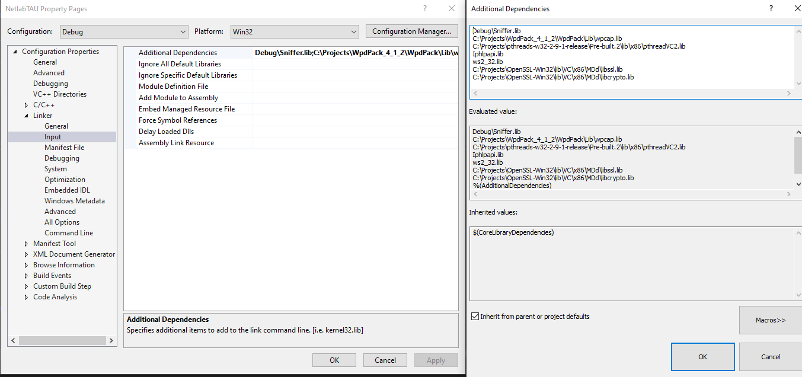
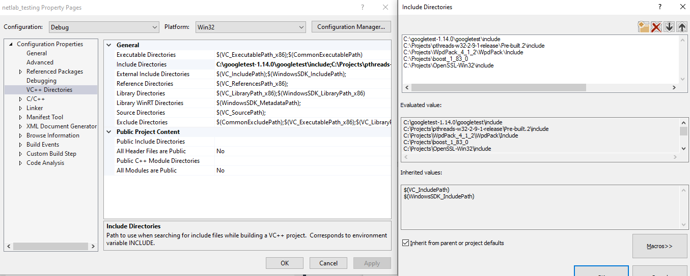
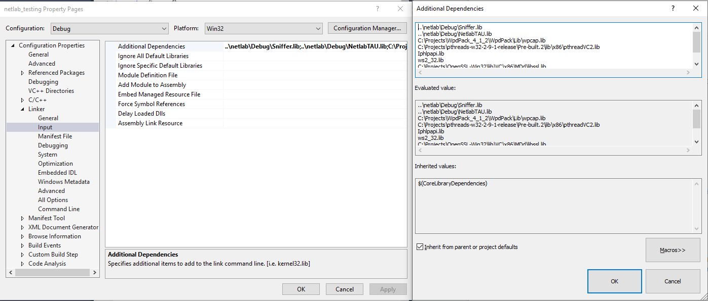

<div align="center">


# NetlabTAU Project

</div>

# NetlabTAU Project

This project is part of the **Advanced Computer Communications Lab** at **Tel-Aviv University**. It aims to improve the infrastructure of network protocol testing by refining the current implementation and integrating new protocols across various system layers. The following document provides a detailed guide on how to install, configure, test, and debug the project.

## Table of Contents

- [Setup](#setup)
  - [Installation](#installation)
  - [Project Configuration](#project-configuration)
  - [Debug Tools](#debug-tools)
- [Tests](#tests)
  - [General](#general)
  - [Setting Up GoogleTest](#setting-up-googletest)
  - [Testing Approach](#testing-approach)
  - [How to Use](#how-to-use)
  - [How to Add Tests](#how-to-add-tests)
  - [Implemented Tests Overview](#implemented-tests-overview)
  - [How to Check the Implementation of Students](#how-to-check-the-implementation-of-students)
- [Notes](#notes)
  - [TLS Debugging](#tls-debugging)
  - [L0 Buffer](#l0-buffer)
  - [HTTP](#http)

---

## Setup

### Installation

1. Install **Microsoft Visual Studio 2022**.
2. Clone the [NetlabTAU](https://github.com/GabrielKlyatis/NetlabTAU) project repository onto your machine.
3. Download and install the latest versions of the following:
   - [Boost](https://www.boost.org/users/download/) version 1.83.
   - [pthreads-win32](https://sourceware.org/pthreads-win32/).
   - [WinPcap Developer’s Pack](https://www.winpcap.org/devel.htm) version 4.1.2.
   - [OpenSSL](https://slproweb.com/products/Win32OpenSSL.html) version 3.0+ (Win32/Win64 based on your system).
   - [GoogleTest framework](https://github.com/google/googletest).

### Project Configuration

1. Under "Solution Explorer", right-click the **Sniffer** project and choose **Properties**:
   - Go to **VC++ Directories** and edit the **Include Directories** section.
     
   - Insert the paths for the installed dependencies (WpdPack, Boost, pthread, OpenSSL, and GoogleTest).
   - Set the **Configuration Type** to static library (`.lib`).
     
   
2. Right-click the **NetlabTAU** project in "Solution Explorer" and choose **Properties**:
   - Edit the **Include Directories** section for WpdPack, pthread, Boost, OpenSSL, and GoogleTest.
     
     The exact paths in our configuration for each of the libraries:
        ```
        - C:\googletest1.14.0\googletest\include
        - C:\Projects\pthreads-w32-2-9-release\Pre-built.2\include
        - C:\Projects\WpdPack 4 1 2\WpdPack\Include
        - C:\Projects\boost 1 83 0
        - C:\Projects\OpenSSL-Win32\include
        ```
   - If NetlabTAU is an executable project, go to **Linker > Input** and add the paths for the required libraries (e.g., `wpcap.lib`, `pthreadVC2.lib`, etc.).
       ```
        – wpcap.lib
        – pthreadVC2.lib
        – Iphlpapi.lib
        – ws2 32.lib
        – libssl.lib
        – libcrypto.lib
       ```
    

    The exact paths in our configuration for each of the files:
       ```
        - Debug\Sniffer.lib
        - C:\Projects\WpdPack 4 1 2\WpdPack\Lib\wpcap.lib
        - C:\Projects\pthreads-w32-2-9-1-release\Pre-built.2\lib\x86\pthreadVC2.lib
        - Iphlpapi.lib
        - ws2 32.lib
        - C:\Projects\OpenSSL-Win32\lib\VC\x86\MDd\libssl.lib
        - C:\Projects\OpenSSL-Win32\lib\VC\x86\MDd\libcrypto.lib
       ```

4. Finally, under ”Solution Explorer”, right-click the **netlab testing** project and choose ”Properties”.
Go to ”VC++ Directories” and edit the ”Include Directories” section - Insert the paths for the previously installed dependencies of WpdPack, pthread, Boost, OpenSSL and GoogleTest.

  

  The exact paths in our configuration for each of the libraries:
      ```
      - C:\googletest1.14.0\googletest\include
      - C:\Projects\pthreads-w32-2-9-release\Pre-built.2\include
      - C:\Projects\WpdPack 4 1 2\WpdPack\Include
      - C:\Projects\boost 1 83 0
      - C:\Projects\OpenSSL-Win32\include
      ```
5. Go to ”Linker”, ”Input” and edit the ”Additional Dependencies” section - Insert the paths for:

  ```
      – Sniffer.lib
      – NetlabTAU.lib
      – wpcap.lib
      – pthreadVC2.lib
      – Iphlpapi.lib
      – ws2 32.lib
      – libssl.lib
      – libcrypto.lib
  ```
  
  

  The exact paths in our configuration for each of the files:
      ```
      ..\netlab\Debug\Sniffer.lib
      ..\netlab\Debug\NetlabTAU.lib
      C:\Projects\WpdPack 4 1 2\WpdPack\Lib\wpcap.lib
      C:\Projects\pthreads-w32-2-9-1-release\Pre-built.2\lib\x86\pthreadVC2.lib
      Iphlpapi.lib
      ws2 32.lib
      C:\Projects\OpenSSL-Win32\lib\VC\x86\MDd\libssl.lib
      C:\Projects\OpenSSL-Win32\lib\VC\x86\MDd\libcrypto.lib
      ```
  
### Debug Tools

To aid in debugging the project, the following tools are recommended:
- **Visual Studio’s Debugger**: Integrated debugging tool for setting breakpoints, inspecting variables, etc.
- **Wireshark**: Network protocol analyzer to capture and analyze traffic.
- **Postman**: API testing tool to inspect HTTP traffic.

---

## Tests

### General

The testing framework for this project is based on **GoogleTest (GTest)**, which simplifies writing unit tests for C++ projects. The tests are encapsulated within test fixtures to ensure modular and maintainable code.

### Setting Up GoogleTest

1. Download and install [GoogleTest](https://github.com/google/googletest).
2. Ensure that GoogleTest is linked to the project.
3. Compile the tests using Visual Studio or the command line.

### Testing Approach

Each test follows a structured interface using the `setUp()` and `tearDown()` methods. The testing stages include:
- **Constructor**: Initializes the test components.
- **setUp()**: Configures the network components.
- **Test Execution**: Sends and receives data.
- **tearDown()**: Terminates the components and connections.

### How to Use

1. Ensure that you have GoogleTest installed and properly linked to your project.
2. Compile the tests - to compile tests with GoogleTest, make sure the appropriate include directories and libraries are
linked (e.g., via Visual Studio). Then, proceed to build your project.
3. Run the tests using either Visual Studio or the Command Line
  To run all tests:
     ```
     ./netlab_testing
     ```
  If you want to run a specific test, use the ```--gtest``` filter flag. The syntax is: ```TestSuite.TestName```.
  You can also use the wildcard * to run all tests under a specific test suite, for example:
     ```
     ./netlab_testing --gtest_filter=tcpTest.sender_test
     ```
Or to run all tests under the TCP Tests suite:
  ```
  ./netlab_testing --gtest_filter=TCP_Tests.*
  ```

Other Useful flags:

```
--gtest repeat=[COUNT]
```
Runs the test suite multiple times. 
```
--gtest shuffle
``` 
Runs the tests in a random order.
  
For example, the following command runs all TCP Tests tests 100 times in random order:
```
./netlab_testing --gtest_filter=tcpTest.* --gtest_repeat=100 --gtest_shuffle
```

## Contributors

- **Gabriel Klyatis**
- **Niv Shani**
- **Supervisors**: Prof. Boaz Patt-Shamir, Dr. Tom Mahler

## License
This project is licensed under the Tel-Aviv University licensing terms. Refer to the LICENSE file for more information.
