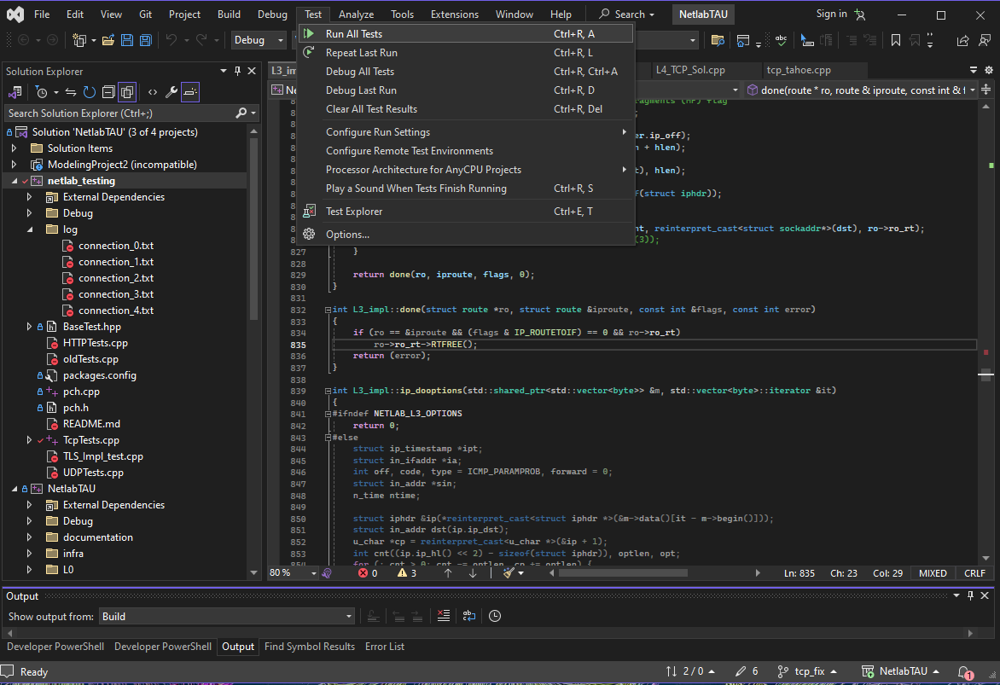

<div align="center">


# NetlabTAU Project

</div>

# NetlabTAU Project

This project is part of the **Advanced Computer Communications Lab** at **Tel-Aviv University**. It aims to improve the infrastructure of network protocol testing by refining the current implementation and integrating new protocols across various system layers. The following document provides a detailed guide on how to install, configure, test, and debug the project.

## Table of Contents

- [Setup](#setup)
  - [Installation](#installation)
  - [Project Configuration](#project-configuration)
  - [Debug Tools](#debug-tools)
- [Tests](#tests)
  - [General](#general)
  - [Setting Up GoogleTest](#setting-up-googletest)
  - [Testing Approach](#testing-approach)
  - [How to Use](#how-to-use)
  - [How to Add Tests](#how-to-add-tests)
  - [Implemented Tests Overview](#implemented-tests-overview)
  - [How to Check the Implementation of Students](#how-to-check-the-implementation-of-students)
- [Notes](#notes)
  - [TLS Debugging](#tls-debugging)
  - [L0 Buffer](#l0-buffer)
  - [HTTP](#http)

---

## Setup

### Installation

1. Install **Microsoft Visual Studio 2022**.
2. Clone the [NetlabTAU](https://github.com/GabrielKlyatis/NetlabTAU) project repository onto your machine.
3. Download and install the latest versions of the following:
   - [Boost](https://www.boost.org/users/download/) version 1.83.
   - [pthreads-win32](https://sourceware.org/pthreads-win32/).
   - [WinPcap Developer’s Pack](https://www.winpcap.org/devel.htm) version 4.1.2.
   - [OpenSSL](https://slproweb.com/products/Win32OpenSSL.html) version 3.0+ (Win32/Win64 based on your system).
   - [GoogleTest framework](https://github.com/google/googletest).

### Project Configuration

1. Under "Solution Explorer", right-click the **Sniffer** project and choose **Properties**:
   - Go to **VC++ Directories** and edit the **Include Directories** section.
     
   - Insert the paths for the installed dependencies (WpdPack, Boost, pthread, OpenSSL, and GoogleTest).
   - Set the **Configuration Type** to static library (`.lib`).
     
   
2. Right-click the **NetlabTAU** project in "Solution Explorer" and choose **Properties**:
   - Edit the **Include Directories** section for WpdPack, pthread, Boost, OpenSSL, and GoogleTest.
     
     - The exact paths in our configuration for each of the libraries:
        ```
        - C:\googletest1.14.0\googletest\include
        - C:\Projects\pthreads-w32-2-9-release\Pre-built.2\include
        - C:\Projects\WpdPack 4 1 2\WpdPack\Include
        - C:\Projects\boost 1 83 0
        - C:\Projects\OpenSSL-Win32\include
        ```
   - If NetlabTAU is an executable project, go to **Linker > Input** and add the paths for the required libraries (e.g., `wpcap.lib`, `pthreadVC2.lib`, etc.).
       ```
        – wpcap.lib
        – pthreadVC2.lib
        – Iphlpapi.lib
        – ws2 32.lib
        – libssl.lib
        – libcrypto.lib
       ```
    

  - The exact paths in our configuration for each of the files:
       ```
        - Debug\Sniffer.lib
        - C:\Projects\WpdPack 4 1 2\WpdPack\Lib\wpcap.lib
        - C:\Projects\pthreads-w32-2-9-1-release\Pre-built.2\lib\x86\pthreadVC2.lib
        - Iphlpapi.lib
        - ws2 32.lib
        - C:\Projects\OpenSSL-Win32\lib\VC\x86\MDd\libssl.lib
        - C:\Projects\OpenSSL-Win32\lib\VC\x86\MDd\libcrypto.lib
       ```

4. Finally, under ”Solution Explorer”, right-click the **netlab testing** project and choose ”Properties”.
Go to ”VC++ Directories” and edit the ”Include Directories” section - Insert the paths for the previously installed dependencies of WpdPack, pthread, Boost, OpenSSL and GoogleTest.

  

  - The exact paths in our configuration for each of the libraries:
      ```
      - C:\googletest1.14.0\googletest\include
      - C:\Projects\pthreads-w32-2-9-release\Pre-built.2\include
      - C:\Projects\WpdPack 4 1 2\WpdPack\Include
      - C:\Projects\boost 1 83 0
      - C:\Projects\OpenSSL-Win32\include
      ```
5. Go to ”Linker”, ”Input” and edit the ”Additional Dependencies” section - Insert the paths for:

  ```
      – Sniffer.lib
      – NetlabTAU.lib
      – wpcap.lib
      – pthreadVC2.lib
      – Iphlpapi.lib
      – ws2 32.lib
      – libssl.lib
      – libcrypto.lib
  ```
  
  

  - The exact paths in our configuration for each of the files:
      ```
      - ..\netlab\Debug\Sniffer.lib
      - ..\netlab\Debug\NetlabTAU.lib
      - C:\Projects\WpdPack 4 1 2\WpdPack\Lib\wpcap.lib
      - C:\Projects\pthreads-w32-2-9-1-release\Pre-built.2\lib\x86\pthreadVC2.lib
      - Iphlpapi.lib
      - ws2 32.lib
      - C:\Projects\OpenSSL-Win32\lib\VC\x86\MDd\libssl.lib
      - C:\Projects\OpenSSL-Win32\lib\VC\x86\MDd\libcrypto.lib
      ```
  
### Debug Tools

Debugging tools are essential for identifying and resolving issues in software development. The following
Tools are a must to understand and handle the project:

- **Visual Studio’s Debugger**: A powerful integrated tool that allows you to set breakpoints, inspect
variables, and step through code execution. It simplifies debugging C++ projects by providing a
clear view of the program’s state during runtime. Comes with the IDE ([Beginner's Tutorial](https://learn.microsoft.com/en-us/visualstudio/debugger/debugger-feature-tour?view=vs-2022)).

- **Wireshark version 4.2.2**: A widely used network protocol analyzer that captures and displays
real-time data traffic. This is invaluable for debugging networking protocols and verifying commu-
nication flows within the project. You can get it [here](https://www.wireshark.org/download.html).

- **Postman**: A widely used API testing tool that allows users to send HTTP requests and
analyze responses. It helps developers inspect HTTP traffic by providing detailed views of requests,
responses, headers, and status codes. This makes it ideal for testing and debugging APIs, as well
as monitoring client-server interactions. You can get it [here](https://www.postman.com/downloads/).

---

## Tests

### General

The testing framework for this project has been developed in a separate repository named netlab-testing,
ensuring that all testing efforts are modular and easily maintainable. At the core of our testing strategy
is GoogleTest (GTest), a robust and widely adopted framework for writing C++ tests. GTest not only
simplifies the process of writing unit tests but also integrates seamlessly with modern development tools,
enabling automated test execution and result analysis. By leveraging this powerful framework, we ensure
that our code remains reliable, maintainable, and easy to refactor as the project evolves.

More on the GoogleTest framework can be found in the [official documentation](https://google.github.io/googletest/)

### Setting Up GoogleTest

1. Download and install [GoogleTest](https://github.com/google/googletest).
2. Setup [GoogleTest in Visual Studio](https://learn.microsoft.com/en-us/visualstudio/test/how-to-use-google-test-for-cpp?view=vs-2022).
3. Setup netlab testing’s project environment, as described above.

### Testing Approach

In our testing approach using Google Test (GTest), each test is encapsulated within a test fixture object,
which follows a structured interface: ```setUp()``` and ```tearDown()```. For consistency and modularity, we have
designed every protocol test as a test fixture. The flow of each test is broken down into four key stages:

- **Constructor**: Initializes the test components (such as the TCP/IP stack layers and network inter-
face controllers). This is executed only once per test.
- **setUp()**: Configures two inet os instances (client and server), spawns packet sniffers, and initializes
the network domain.
- **Test Execution**: Sends and receives data, performing comparative tests between regular OS sockets
and inet os sockets.
- **tearDown()**: Terminates the sniffers and ensures the connection closes cleanly.
  
### How to Use

1. Ensure that you have GoogleTest installed and properly linked to your project.
2. Compile the tests - to compile tests with GoogleTest, make sure the appropriate include directories and libraries are
linked (e.g., via Visual Studio). Then, proceed to build your project.
3. Run the tests using either Visual Studio or the Command Line
  To run all tests:
     ```
     ./netlab_testing
     ```
  If you want to run a specific test, use the ```--gtest``` filter flag. The syntax is: ```TestSuite.TestName```.
  You can also use the wildcard * to run all tests under a specific test suite, for example:
     ```
     ./netlab_testing --gtest_filter=tcpTest.sender_test
     ```
Or to run all tests under the TCP Tests suite:
  ```
  ./netlab_testing --gtest_filter=TCP_Tests.*
  ```

Other Useful flags:

```
--gtest repeat=[COUNT]
```
Runs the test suite multiple times. 
```
--gtest shuffle
``` 
Runs the tests in a random order.
  
For example, the following command runs all TCP Tests tests 100 times in random order:
```
./netlab_testing --gtest_filter=tcpTest.* --gtest_repeat=100 --gtest_shuffle
```

## Using Visual Studio

To run tests within Visual Studio:

1. Open Visual Studio and choose ”Open a project or solution”:
   
   
3. Navigate to your project directory and choose the .sln or .proj file:
   
   
5. Ensure that your tests are built correctly. Go to Test → Run All Tests or use the Test Explorer window to select and run individual tests:
   
   
7. It's also possible to debug specific tests by right-clicking on them in the Test Explorer and selecting Debug Selected Tests:
   
   
9. Test results will be displayed in the Test Explorer, where you can view the pass/fail status for each test, along with any additional related output.
    
   

## How to Add Tests

As you develop and upgrade the NetlabTAU project, you will likely need to add tests for existing
features or create new test fixtures for newly implemented protocols.

**Adding a Test Fixture:**
To add a test fixture for a new protocol, follow these steps:

- Create a new file in the ‘netlab testing‘ project. Naming conventions like ‘ProtocolTest.hpp‘
and ‘ProtocolTest.cpp‘ are recommended.
- Define the new test fixture. Test fixture are C++ objects and can be inherited. Locate
a similar existing text fixture and inherit from it. If no suitable feature exists, consider
inheriting from ‘test base‘, an abstract text fixture that encompasses most of the TCP/IP
stack.

For example:

```cpp
class TCP_Tests : public test_base {
protected:
      /* Declaring the IP address from the current machine */
      std::string ip_address;
      // Create a SOCKET for listening for incoming connection requests.
      netlab::L5_socket_impl* ListenSocket;
      // Create a SOCKET for connecting to server.
      netlab::L5_socket_impl* ConnectSocket;
      // Create a SOCKET for accepting incoming requests.
      netlab::L5_socket_impl* AcceptSocket;
      // The sockaddr_in structure specifies the address family,
      // IP address, and port for the socket that is being bound (SERVER)
      // and port of the server to be connected to (CLIENT).
      sockaddr_in service;
      sockaddr_in clientService;
      TCP_Tests() : test_base("ip src 10.0.0.10", "ip src 10.0.0.15") {
          inet_server.inetsw(
          new L3_impl(inet_server, SOCK_RAW, IPPROTO_RAW,
          protosw::PR_ATOMIC | protosw::PR_ADDR),
          protosw::SWPROTO_IP_RAW
          );
          inet_client.inetsw(
          new L3_impl(inet_client, SOCK_RAW, IPPROTO_RAW,
          protosw::PR_ATOMIC | protosw::PR_ADDR),
          protosw::SWPROTO_IP_RAW
          );
      }
};
```

Alternatively:

```cpp
class TLS_test : public TCP_Tests {
protected:
    void SetUp() override {
    // Initialize any necessary objects or states.
    }
    void TearDown() override {
    // Clean up any resources that were used during the test.
    }
    // Clean up any resources that were used during the test.
};
```

**Adding a Test Case to a Fixture:**
When writing a test case for a fixture, remember that the fixture’s constructor and ‘SetUp()‘
methods are called before the test case executes.

```cpp
TEST_F(NewProtocolTest, ClientTest) {
    // Arrange: Set up the test conditions.
    // Act: Perform the actions to be tested.
    // Assert: Verify the results.
    ASSERT_EQ(expected_value, actual_value);
}
```

By following these guidelines, you can effectively add and manage test cases within your NetlabTAU
project, ensuring comprehensive testing for all features and protocols.

## Implemented Tests Overview

All the tests compare the result against the implementation of the TCP/IP stack of the computer’s
operating system.

• UDP Tests
    
    test sender - Tests the implementation as the sender side.
    test reciver - Tests the implementation as the receiver side.
    test bigpacket - Tests for IP fragmentation and reconstruction.
    
    
• TCP Tests

    test sender - Tests the implementation as the sender side.
    test reciver - Tests the implementation as the receiver side.
    test bigpacket - Tests the TCP re-transmit and congestion control by moving 10MB between 2 sockets.

To simulate a real environment we’ve add receiver/sender buffers to add delay, and to
drop and duplicate packets.

• TLS Tests

    test client - Tests the implementation as the client side.
    test server - Tests the implementation as the server side.
    
• HTTP Tests - each test implemented for both HTTP and HTTPS.

    test client - Tests the implementation as the client side.
    test server - Tests the implementation as the server side.

## How to Check the Implementation of Students

We developed two methods to check student implementations using the netlab testing infrastruc-
ture. Let’s take a lab assignment about TLS sockets as an example. Each student writes their own
implementation of TLS that inherits from the socket interface. Thus, the test will work because it
only interacts with the socket API.

**Option 1** To minimize the TA’s workload, we can have each student name their implementation
(class) the same as our implementation, which aligns with the test. To do so, follow these steps:

    • Remove our implementation from the project to avoid conflicts (due to the same name).
    • Embed the student implementation (one at a time) in the correct directory.
    • Build the testing project.
    • Run the test and review the results.
    • Repeat.

**Option 2** Now, each implementation has its own unique name. Then, we can do the following:

    • Embed the student’s implementation (no name conflict) in the correct directory.
    • Redefine the socket in the test to be the correct implementation.
    • Build the testing project.
    • Run the test and review the results.
    • Repeat.
    
All in all, option 1 is clearly easier, but option 2 can be explored and developed into a more
complex testing system when we compare students’ implementations against each other.

## Notes

## Contributors

- **Gabriel Klyatis**
- **Niv Shani**
- **Supervisors**: Prof. Boaz Patt-Shamir, Dr. Tom Mahler

## License
This project is licensed under the Tel-Aviv University licensing terms. Refer to the LICENSE file for more information.
